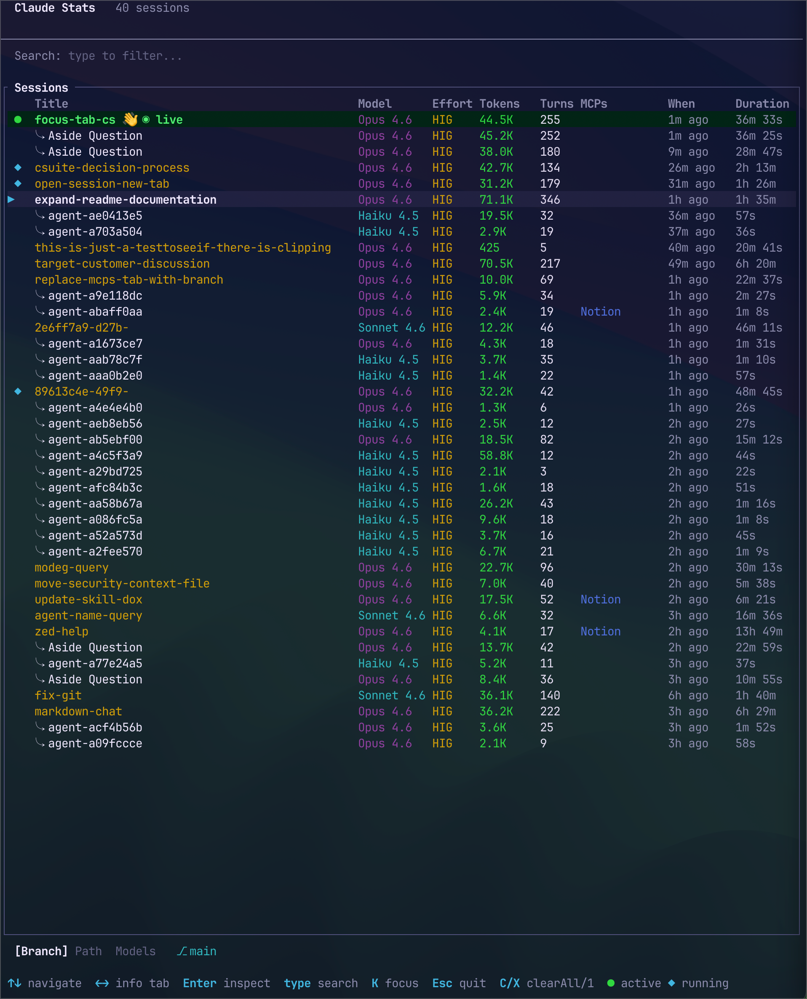
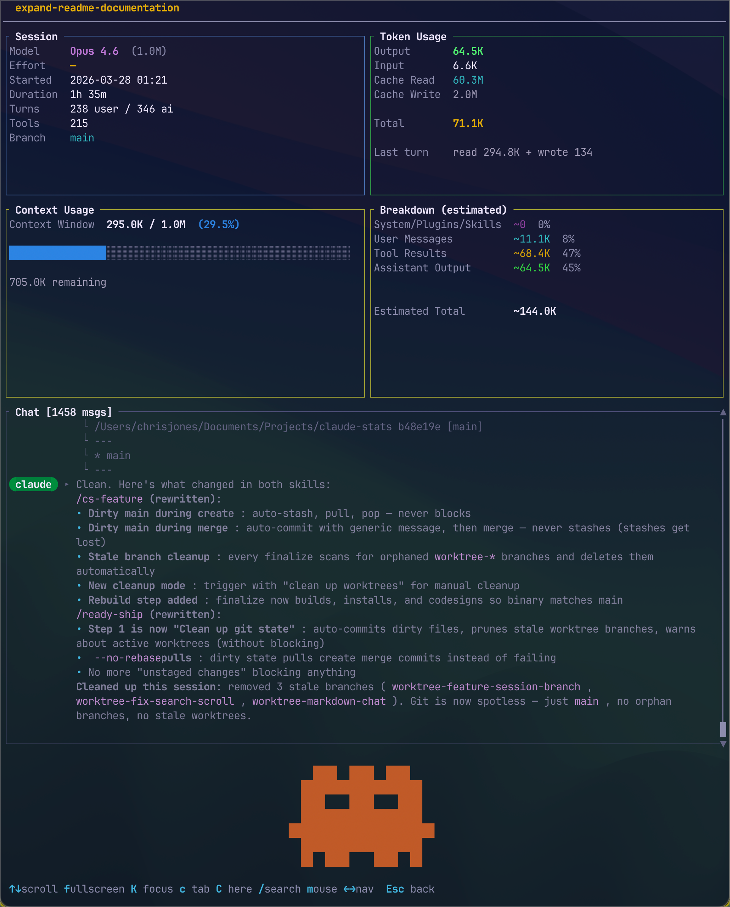
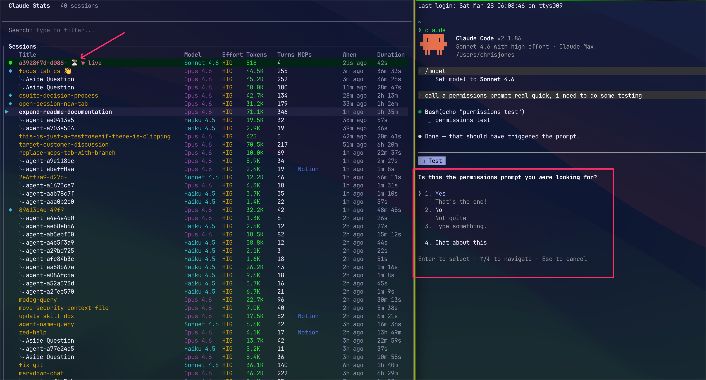
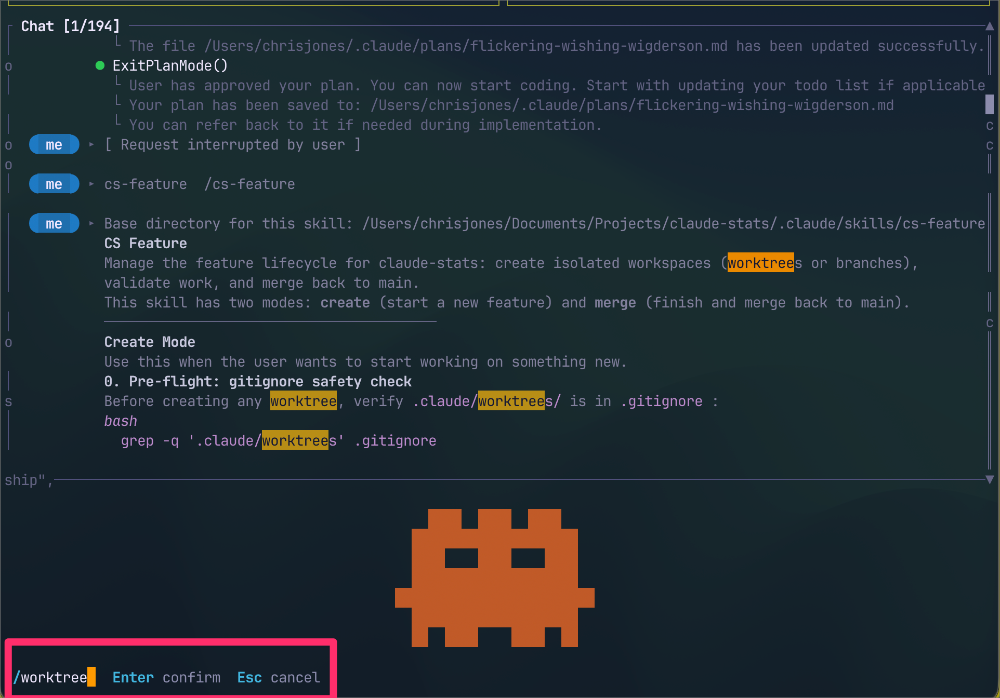
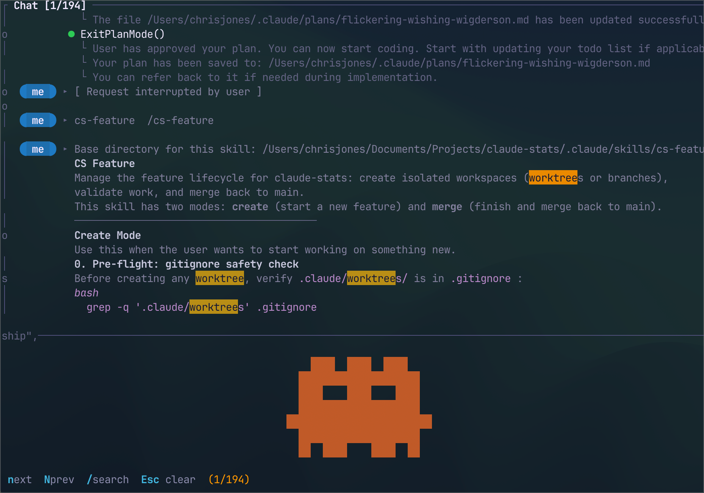
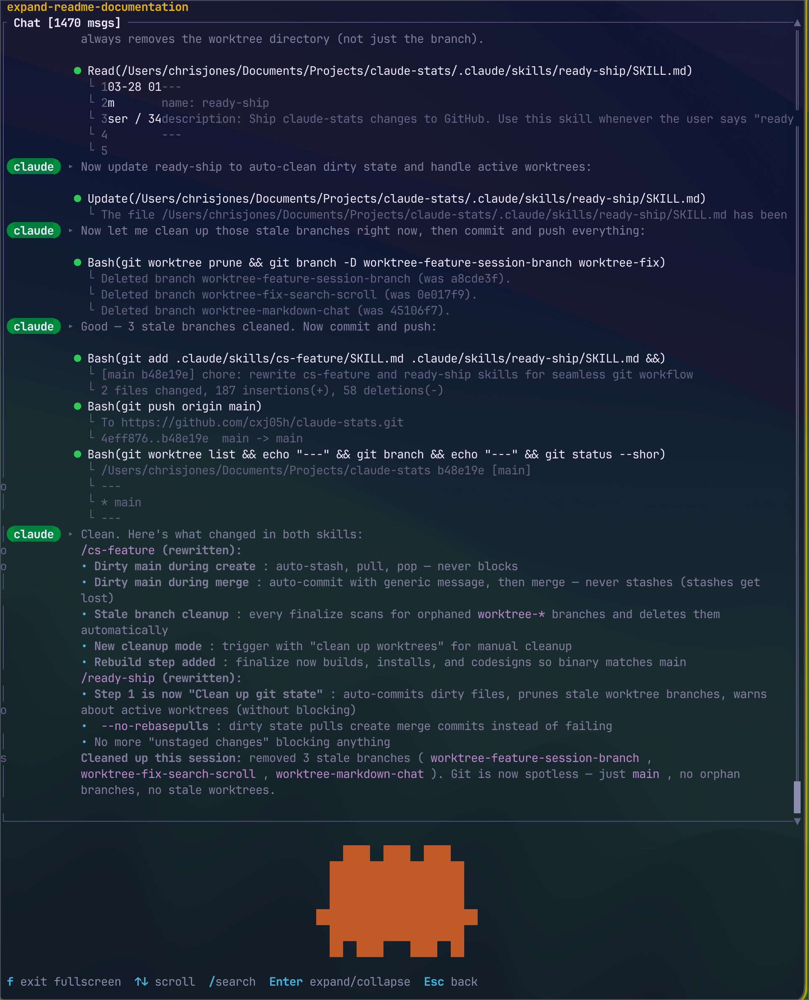
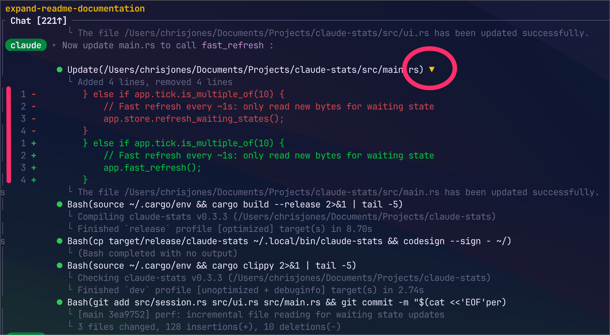

# claude-stats

A terminal dashboard for Claude Code. See all your sessions, token usage, context, and chat history in one place — without leaving the terminal.










## Why

Claude Code sessions pile up fast. You switch models, spawn agents, burn through context, and there's no single place to see what happened or where you left off. claude-stats reads your local session files and gives you a keyboard-driven TUI with everything you'd want: token breakdowns, context usage, model history, and searchable chat logs. No API calls, no config. Just run `claude-stats` (or `cs`).

## Features

### Know which sessions need your attention

Two indicators show up next to session titles when something is waiting:

- **👋** — Claude responded and is waiting for you. Auto-clears after 1 hour or when you open the session.
- **⏳** — A permission prompt or multiselect needs your approval. Title turns red. Clears when you respond in Claude Code or open the session.

Press `X` to clear the indicator on a row, or `C` to clear all at once. Agent sessions never show indicators.

### Archive sessions you're done with

Navigate to the **Archive** tab (`←`/`→`) and press `A` to hide a session from the main list. Use `Shift+↑`/`↓` to multi-select, then `A` to archive in bulk. Press `V` to view archived sessions, `R` to unarchive. Agent sessions (`⤷`) are automatically archived with their parent. Archive state persists across restarts (`~/.claude/stats-archive.json`).

#### Getting back to a waiting session

**iTerm2 / tmux:** Press `K` and claude-stats focuses the terminal tab where the session is already running — instant, no new process.

**Other terminals:** Use `c` (new tab) or `C` (open here) to resume. Note: **`--resume` won't replay Claude's last message** if a session is waiting on you. Check the detail view in claude-stats first to read what Claude said, then resume.

### Jump to any running session

Press `K` on the session list or detail view to focus the tab where that session is running. claude-stats matches sessions to processes via PID/TTY. Sessions with a live process show a blue `◆`. If nothing's running, `K` opens a new tab instead.

### See live sessions at a glance

The active session gets a green `●` and a highlighted row. Indicators update every ~1 second (incremental reads), full reload every ~5 seconds.

### Find any session instantly

Start typing to fuzzy-search across session titles, project paths, and model names. Filters in real time.

### Search inside conversations

Press `/` in the detail view to search chat messages. Matches highlight in yellow, current match in orange. `n`/`N` jumps between results, viewport scrolls to center each one.

### Track agent sessions

Agent sessions spawned by Claude Code are grouped under their parent. Parent rows show `▸ N agents` collapsed by default — click the arrow (or press `Enter` on the parent) to expand and see each agent. Double-click any row to inspect it. Agents are always archived with their parent.

### Monitor context usage

The detail view shows a color-coded bar (blue → green → red at 80%+), raw token count and percentage, and a category breakdown: system prompts, your messages, tool results, assistant output, images.

### Track token consumption

Input, output, cache read, and cache write tokens per session. The Usage tab (cycle with `Left`/`Right` on the session list) shows weekly rollups per model — Opus, Sonnet, total sessions and messages.

### See git branch and model history

The detail view shows which branch or worktree each session ran on. Sessions that switched models show the full timeline (e.g., Opus 4.5 → Sonnet 4.5). Effort level (low/med/high/max) is tracked per session.

## How to Use

### Session list

Launch `claude-stats` and you'll see your 40 most recent sessions:

| Column | Shows |
|--------|-------|
| Title | Session name (agents prefixed with `⤷`) |
| Model | Active model |
| Effort | LOW / MED / HIGH / MAX |
| Tokens | Total input + output |
| Turns | Conversation turns |
| MCPs | Top 2 MCP servers used |
| When | Time since last activity |
| Duration | Total session time |

The info bar below cycles with `Left`/`Right`: **Branch**, **Path**, **Models**, **Archive**.

### Detail view

Press `Enter` to inspect a session:

- **Session info** — model, effort, start time, duration, turns, tool calls, MCP usage, git branch
- **Token usage** — output, input, cache read, cache write, total, last-turn breakdown
- **Context window** — gradient bar, category breakdown, remaining capacity
- **Chat history** — scrollable, markdown rendering, code blocks, diff highlighting, expandable tool calls

Press `f` for fullscreen chat. `Enter` expands/collapses all tool diffs. `Left`/`Right` steps through sessions.

### Quick resume

From the detail view: `c` opens in a new terminal tab (claude-stats stays running), `C` replaces claude-stats with the session. Both launch from the session's original working directory. Auto-detects iTerm2, Terminal.app, Warp, tmux, zellij. Run `claude-stats --config-terminal` to set manually.

## Keybindings

### Session list

| Key | Action |
|-----|--------|
| `↑` / `↓` | Navigate sessions |
| `Shift+↑` / `↓` | Multi-select sessions |
| `←` / `→` | Cycle info tabs |
| `K` | Focus running tab (or open new) |
| `X` | Clear indicator on row |
| `C` | Clear all indicators |
| `A` | Archive selected (on Archive tab) |
| `V` | View archive (on Archive tab) |
| `R` | Unarchive selected (in archive view) |
| `Enter` | Open detail view |
| Type | Fuzzy search |
| `Backspace` | Delete search character |
| `Esc` | Clear selection / search / quit |
| `q` | Quit |

### Detail view

| Key | Action |
|-----|--------|
| `↑` / `↓` | Scroll chat |
| `PgUp` / `PgDn` | Scroll by 10 lines |
| `Home` / `End` | Top / bottom |
| `←` / `→` | Previous / next session |
| `Enter` | Expand/collapse tool diffs |
| `f` | Toggle fullscreen chat |
| `k` / `K` | Focus running tab (or open new) |
| `c` | Open in new terminal tab |
| `C` | Resume here |
| `/` | Search chat |
| `n` / `N` | Next / previous match |
| `m` | Toggle mouse (for text selection) |
| `Esc` / `q` | Back to list |

## Install

### Homebrew (macOS / Linux)

```bash
brew install cxj05h/tap/claude-stats
```

### One-liner (macOS / Linux)

```bash
curl -fsSL https://raw.githubusercontent.com/cxj05h/claude-stats/main/install.sh | bash
```

Installs to `~/.local/bin/claude-stats`. Make sure that's in your `PATH`.

Optionally add a short alias:

```bash
alias cs='claude-stats'
```

### Build from source

```bash
git clone https://github.com/cxj05h/claude-stats
cd claude-stats
cargo build --release
cp target/release/claude-stats ~/.local/bin/
```

Requires Rust 1.70+.

## Data Sources

Reads directly from Claude Code's local files — no API calls:

- `~/.claude/projects/` — session JSONL files
- `~/.claude/stats-cache.json` — weekly token stats
- `~/.claude/stats-config.json` — plan type and terminal config
- `~/.claude/stats-archive.json` — archived session IDs
- `~/.claude/stats.log` — debug log (rotated daily)
- `~/.claude/settings.json` — effort level

Works with both subscription (Pro/Max) and API key auth.

## Dependencies

- [ratatui](https://github.com/ratatui/ratatui) — terminal UI
- [crossterm](https://github.com/crossterm-rs/crossterm) — terminal control
- [serde](https://serde.rs/) / [serde_json](https://github.com/serde-rs/json) — JSONL parsing
- [chrono](https://github.com/chronotope/chrono) — timestamps
- [dirs](https://github.com/dirs-dev/dirs-rs) — home directory
- [fuzzy-matcher](https://github.com/lotabout/fuzzy-matcher) — session search
